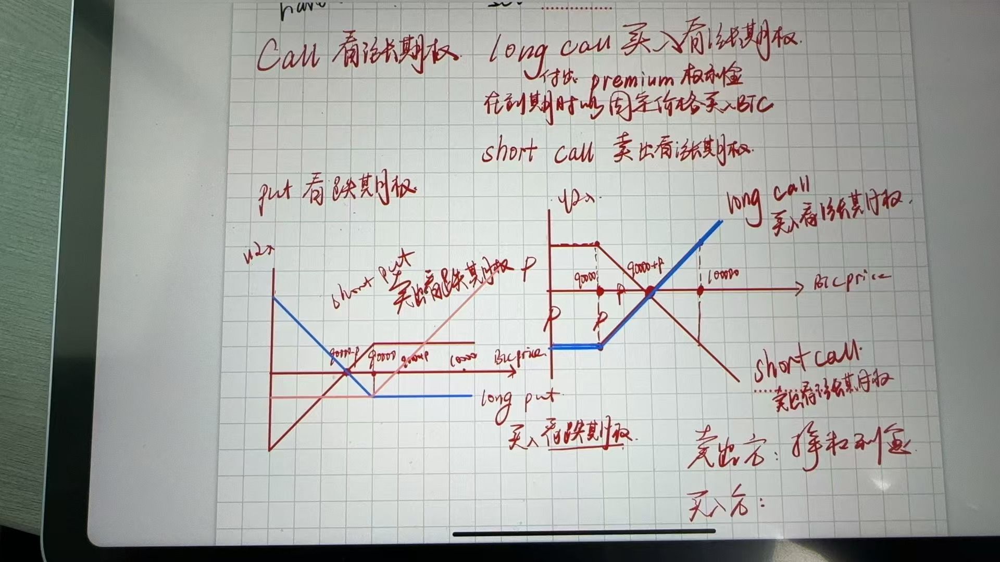

Options（期权）：一种约定在未来时间以特定价格买入或卖出现货的权利。
Call（认购期权）：规定买入期权者在未来特定时间以特定价格买入现货。
认购期权包含两个交易方向：
Long Call（买入认购）
Short Call（卖出认购）

Put（认沽期权）：规定买入期权者在未来特定时间以特定价格卖出现货。
认沽期权包含两个交易方向：
Long Put（买入认沽）
Short Put（卖出认沽）

例如：
以太坊 Long- 20240419- 3600-call
表示，2024年4月19日到期的Eth认购期权，行权价格$3600
如果买入这张期权，到期时选择行权，则可以以$3600的价格买入Eth，假如此时Eth涨到$3700，则赚了；假如此时Eth跌到$3500，可以选择不行权，只损失买入期权的权利金。

如果卖出这张期权，则意味着承诺到期时会如约卖出$3600价格的Eth，无论那时的Eth价格多少，只要有人拿着期权向你行权，你就要履约。作为回报，你可以得到期权权利金。

所以，买方支付权利金，得到一个承诺。卖方许诺一个承诺，得到权利金，期权交易达成。

现实中，买方很多为了安全以小搏大，用期权杠杆来赌单边涨跌。卖方很多事为了对冲现货风险和对冲套利。
例如，核心目的若是想规避币价大跌带来的风险，那应该买入看跌期权。

